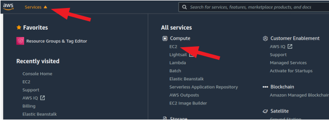
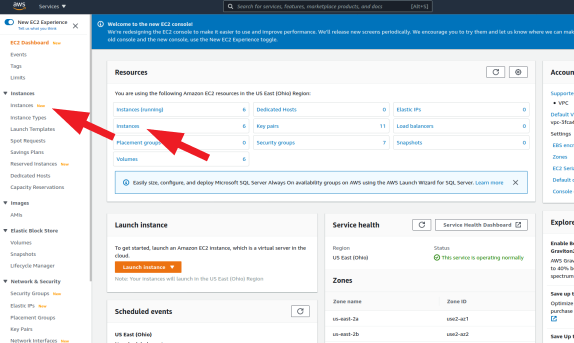
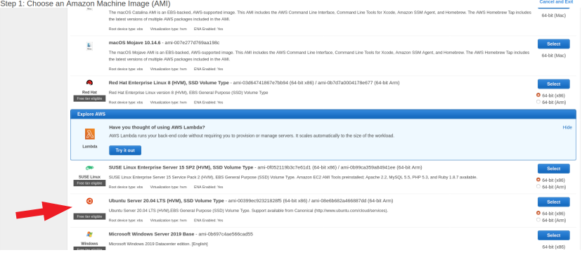
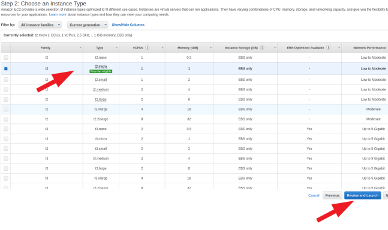
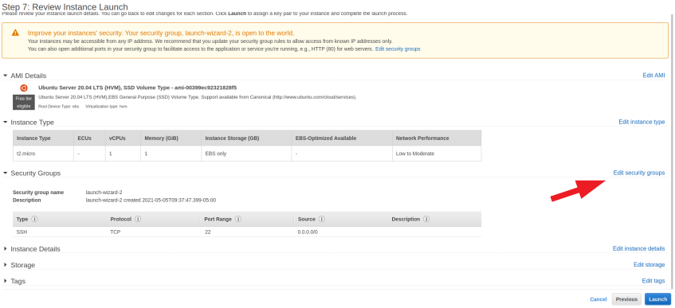
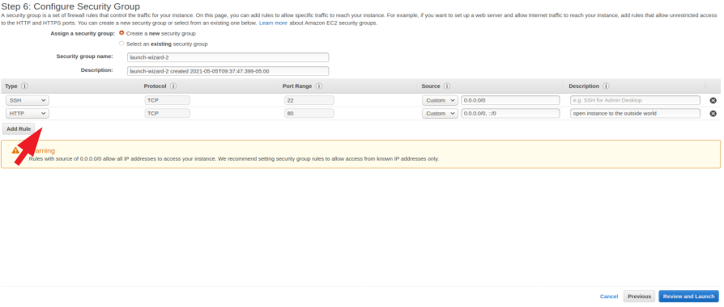

# Installation

If you are planning on contributing code, please read [contribute](./contribute.md)

If you are going to install this on your local computer, skip to [Clone the repository and configure](#Clone-the-repository-and-configure). Else, you may want to use an AWS instance.

## Create a AWS Ubuntu 20.04 EC2 instance

- Log into [amazon AWS](https://aws.amazon.com)

- Find the 'EC2' service somewhere -- there are multiple locations. One spot it will always be is in the __service menu__ to the top left of your screen  



- Open the 'Instances' page  



- Launch a new isntance


- Choose Ubuntu 20.04



- Select the free 'free tier eligible' instance type (if you're outside of your free window, choose whatever is most appropriate) and click "Review and Launch"



- The next page will just be a review of your choices thus far. Click "Configure Security Group"



- Click "Add Rule", from the dropdown select "HTTP". The default that is filled in Source should be correct, but make sure that it is the same as the image below. Click "Review and Launch" when done.



- You will be directed back to the overview page again. Click "Launch".

- You now need to wait until the instance is running, which takes a few minutes. Once it is running, click the 'instance ID' link


- Click 'connect', go to the SSH client tab (should be open by default), and follow the instructions to connect through your terminal. Note: best practice would be to create a user at this point. You can then add a ssh_key and make the login easier. Follow instructions [here to create a user with sudo permission](https://classes.engineering.wustl.edu/cse330/index.php?title=Linux#User_Management) and [here to add your ssh_key](https://classes.engineering.wustl.edu/cse330/index.php?title=SSH#SSH_Configuration)

## Create the database, if you need to

If you are planning on using this locally, the 'local' profile is set up to run sqlite. If you are planning on deploying this, or using it more formally on your local, then you should first install psql. Some settings will need to be changed in the code to determine which profile you are using (local or production). Those steps are described below.

Follow the steps here to create a postgresql database:  

[set up django with postgres, gunicorn and nginx on ubuntu 20.04](https://www.digitalocean.com/community/tutorials/how-to-set-up-django-with-postgres-nginx-and-gunicorn-on-ubuntu-20-04)  

## Clone the repository and configure  

1. Once you are signed in and have your user, ssh, etc all set up the way you want it (or your are installing this locally), `git clone` the repo to the place where you want to keep the source code.

 - Note: If you don't want to use postgresql, for instance if you are doing local development, then at this point, you could use docker and skip any other downloading/configuring. Just do this:

Start the dev server for local development:  

```bash
docker-compose build
```  

Create a superuser to login to the admin:  

```bash
docker-compose run --rm web ./manage.py createsuperuser
```  

Launch the development server
```bash
docker-compose up
```

However, if you want to have one less barrier between you and the code, or you are planning to deploy the database from this system, then don't use docker. In that case, follow the instructions below:

2. create a file in the root called `.env`, which will store our environmental variables (like a username). This is already in the .gitignore, but you should go ahead and confirm that. Fill it with the following types of information (The keys included below are required, but for example, if you are not using AWS S3 storage, you may set them to empty strings):

```
DJANGO_SECRET_KEY=aslkdjf!@123123l1kj2laksjdf3
ALLOWED_HOST=["0.0.0.0", "localhost", "127.0.0.1"]
DJANGO_AWS_ACCESS_KEY_ID="" # may be left as an empty string
DJANGO_AWS_SECRET_ACCESS_KEY="" # may be left as an empty string
DJANGO_AWS_STORAGE_BUCKET_NAME="" # may be left as an empty string
DJANGO_PAGINATION_LIMIT=100
DATABASE_NAME="your_database"
DATABASE_USERNAME="your_username"
DATABASE_PASSWORD="your_password"
HOST_IP="127.0.0.1"
```

3. create an empty directory called `.venv`, which pipenv will automatically find. This will mean that the virtual environment will be stored inside the root. This is also in the .gitignore.

4. edit `manage.py`. In the main() method, set `"DJANGO_CONFIGURATION", "Local")` to either `"Local"`, which is default, or `"Production"`. You can see the config files in the ./config directory. The most important effect of setting the `DJANGO_CONFIGURATION` is that `"Local"` is sqlite, `"Production"` is postgresql.

5. In the root, run `pipenv install -r requirements.txt` to install the environment. Note: this has been finnicky about python version -- use the version listed in the Pipfile

6. launch the environment with `pipenv shell`

## Configuring Postgresql, Gunicorn and Nginx

Once you are signed in and have your user, ssh, etc all set up the way you want it, `git clone` the repo. Next, follow these instructions[set up django with postgres and gunicorn on ubuntu 20.04](https://www.digitalocean.com/community/tutorials/how-to-set-up-django-with-postgres-nginx-and-gunicorn-on-ubuntu-20-04)  

I don't feel that I can improve on the link above -- if the link doesn't work, you have trouble with a step, or have questions, email chasem@wustl.edu.